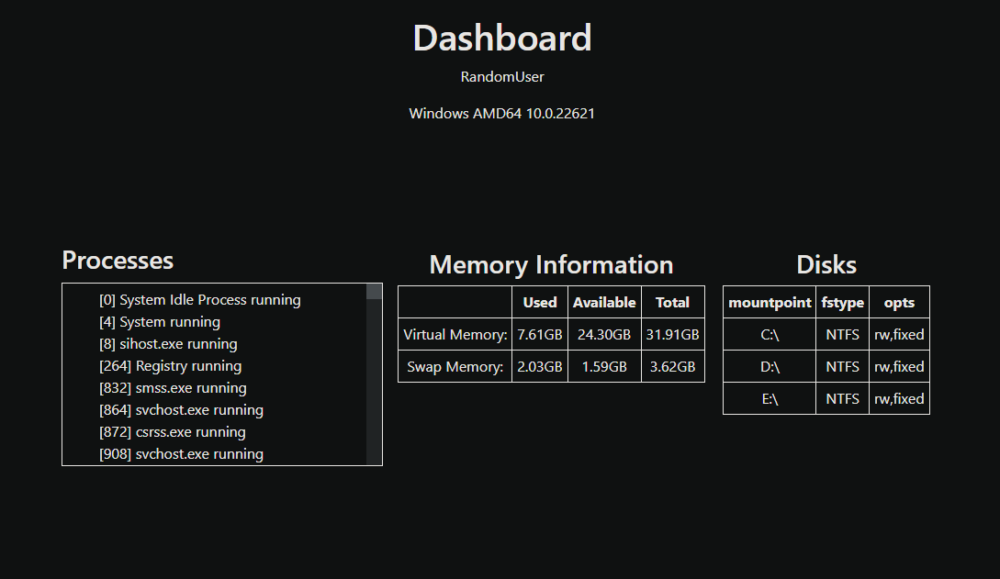
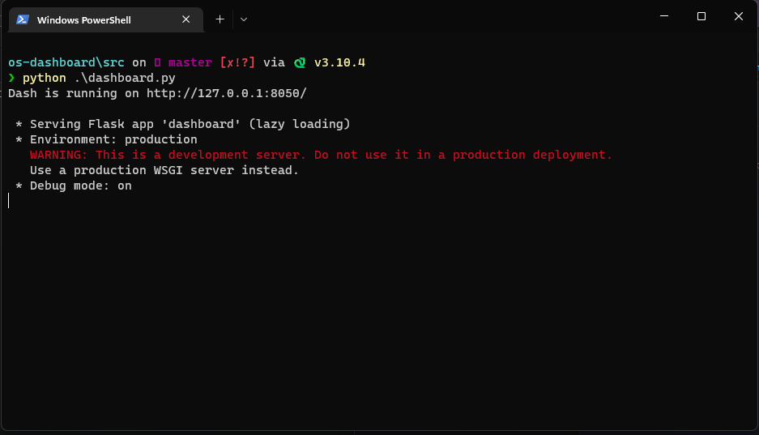

# os-dashboard

## Dashboard para monitorar o hardware do computador
<br/>
Dados sobre processos, memória e discos atualizados a cada segundo
<br/>
<br/>




### Para executar:
```bash
pip install -r src/requirements.txt
```
```bash
python src/dashboard.py
```
O dashboard ficará disponível no endereço 127.0.0.1:8050.
Basta acessar com seu navegador


